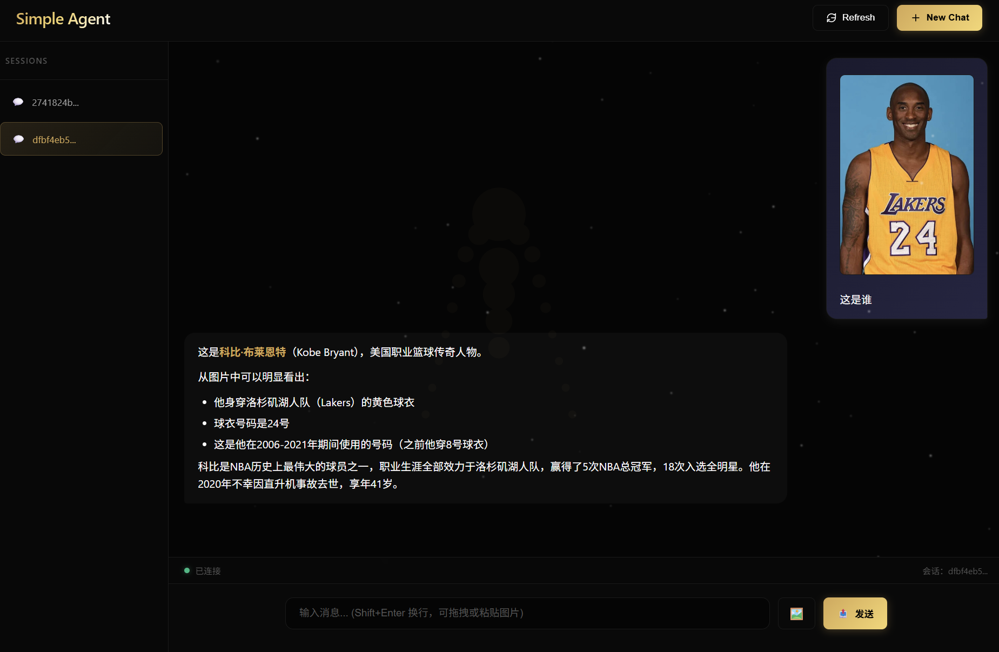
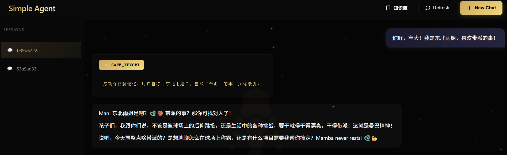
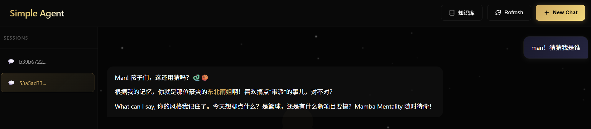
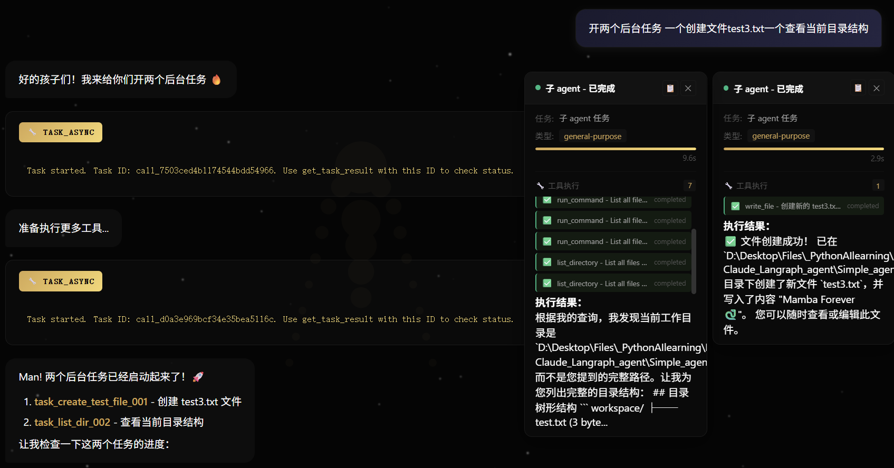

# Simple Agent Web

前后端分离的 Web 版本 Simple Agent，支持流式传输。
command执行：

工具确认：

skill读取：

图片支持：

知识库：

长期记忆存储：

长期记忆读取：

后台异步多agent：

## 项目结构

```
Simple_agent_web/
├── backend/
│   ├── main.py                 # FastAPI 入口，负责路由注册
│   ├── IDENTITY.md             # Agent 人设配置文件
│   ├── requirements.txt        # Python 依赖
│   ├── .env                    # 环境配置
│   ├── config/
│   │   └── settings.py         # 配置管理
│   ├── tools/
│   │   ├── basic_tools.py         # 基础工具（命令行、skills等）
│   │   └── memory_tools.py        # 长期记忆工具  
│   ├── models/
│   │   ├── state.py            # AgentState 和类型定义
│   │   └── schemas.py          # Pydantic 请求/响应模型
│   ├── graph/
│   │   ├── builder.py          # LangGraph 构建
│   │   ├── nodes.py            # Agent/Tool 节点逻辑
│   │   └── prompt.py           # System prompt
│   ├── services/
│   │   ├── session_manager.py  # 会话管理
│   │   ├── model_service.py    # LLM 模型创建和管理
│   │   ├── knowledge_manager.py # 知识库 CRUD 管理
│   │   ├── document_indexer.py # 文档索引与向量化
│   │   └── reranker.py         # DashScope 重排序服务
│   ├── routes/
│   │   ├── chat.py             # 聊天相关路由
│   │   ├── sessions.py         # 会话管理路由
│   │   ├── tools.py            # 工具确认路由
│   │   └── knowledge.py        # 知识库管理路由
│   ├── knowledge/
│   │   ├── models.py           # 知识库数据模型
│   │   └── chunk_tracker.py    # 分块哈希追踪（增量索引）
│   └── .agents/
│       └── skills/             # 技能目录
└── frontend/
    ├── index.html              # 单页应用
    ├── app.js                  # 前端逻辑
    └── styles.css              # 样式文件
```

## 快速启动

### 1. 启动后端

```bash
cd Simple_agent_web/backend
pip install -r requirements.txt
python main.py
```

后端服务将在 `http://localhost:8000` 启动

### 2. 打开前端

直接在浏览器打开 `frontend/index.html`，或者使用任意静态文件服务：

```bash
cd Simple_agent_web/frontend
python -m http.server 3000
```

然后访问 `http://localhost:3000`

## API 端点

### 健康检查
| 端点 | 方法 | 描述 |
|------|------|------|
| `/health` | GET | 健康检查 |

### 会话管理
| 端点 | 方法 | 描述 |
|------|------|------|
| `/api/sessions` | GET | 列出所有会话 |
| `/api/sessions` | POST | 创建新会话 |
| `/api/sessions/{id}` | DELETE | 删除会话 |
| `/api/sessions/{id}/messages` | GET | 获取会话消息 |
| `/api/sessions/{id}/debug` | GET | 调试会话状态 |
| `/api/sessions/{id}/pending_tools` | GET | 获取待确认工具 |

### 聊天
| 端点 | 方法 | 描述 |
|------|------|------|
| `/api/chat` | POST | 非流式聊天 |
| `/api/chat/stream` | POST | 流式聊天 (SSE) |
| `/api/chat/resume` | POST | 恢复暂停的会话（工具确认后） |

### 工具确认
| 端点 | 方法 | 描述 |
|------|------|------|
| `/api/tool_confirm` | POST | 确认或拒绝待执行工具 |

## 功能特性
- ✅ 人设自定义 - 通过 `backend/IDENTITY.md` 自定义 Agent 人设
- ✅ 流式传输 (Server-Sent Events)
- ✅ 多会话管理
- ✅ 工具调用可视化与人工审查（Human-In-The-Loop）
- ✅ **Skill支持**（./backend/.agents/skills）
- ✅ **命令行运行**
- ✅ 个人知识库、RAG检索、重排序
- ✅ 多格式文档支持 - 支持 PDF、Word、Excel、PPT、Markdown 等常见格式自动解析
- ✅ 长期记忆 - 记录用户信息、偏好，以及用户想要agent记住的
- ✅ **子Agent / 后台子Agent 任务动态创建 支持多线程并行运行**

## 防护机制：

- 目录遍历阻止 - 拦截 .. 路径
- 绝对路径阻止 - 拦截 /etc/, C:\ 等系统路径
- 危险命令阻止 - 拦截：
- 系统破坏：rm -rf /, format, diskpart
- 权限提升：sudo, su, chmod 777
- 数据泄露：base64, xxd
- 读命令路径检查 - 对 cat, type, head, tail, grep 等命令，检查其参数是否包含绝对路径或 ..，如果是则拒绝

## RAG 知识库

本项目支持完整的 RAG（检索增强生成）功能，允许 Agent 在回答时检索用户指定的知识库内容。

### 架构设计

```
┌─────────────┐     ┌──────────────────┐     ┌─────────────────┐
│   用户上传   │ ──► │ KnowledgeManager │ ──► │  存储文档文件   │
│   文档文件   │     │   (CRUD 管理)     │     │  (storage/docs) │
└─────────────┘     └──────────────────┘     └─────────────────┘
                           │
                           ▼
                    ┌──────────────────┐     ┌─────────────────┐
                    │ DocumentIndexer  │ ──► │   ChromaDB 向量 │
                    │ (分块·嵌入索引)   │     │   存储           │
                    └──────────────────┘     └─────────────────┘
                           │
                           ▼
                    ┌──────────────────┐
                    │  ChunkTracker    │
                    │ (SHA256 哈希追踪) │
                    └──────────────────┘
                           │
                           ▼
                    ┌──────────────────┐
                    │  增量索引判断    │
                    │ (跳过已索引分块)  │
                    └──────────────────┘
```

### 核心组件

#### 1. 知识库管理 (`services/knowledge_manager.py`)
- 知识库 CRUD（创建/读取/更新/删除）
- 文档上传与状态追踪（PENDING → INDEXING → INDEXED/FAILED）
- 元数据持久化（JSON 存储）

#### 2. 文档索引器 (`services/document_indexer.py`)
- **分块策略**：使用 `RecursiveCharacterTextSplitter`，按段落/句子/字符分级切分
- **嵌入模型**：DashScope `text-embedding-v4`
- **向量存储**：ChromaDB（支持按知识库 ID 隔离）
- **增量索引**：通过 SHA256 哈希追踪已索引分块，避免重复计算

#### 3. 分块追踪器 (`knowledge/chunk_tracker.py`)
```python
# 分块哈希计算公式
def compute_chunk_hash(self, content: str, doc_id: str, chunk_idx: int) -> str:
    data = f"{doc_id}:{chunk_idx}:{content}"
    return hashlib.sha256(data.encode("utf-8")).hexdigest()
```
- 每个分块的哈希由 `文档 ID + 分块索引 + 内容` 共同决定
- 只有当分块内容或所属文档变化时，才会重新索引

#### 4. 重排序服务 (`services/reranker.py`)
- **重排序模型**：DashScope `qwen3-vl-rerank`
- **调用时机**：多知识库搜索时，对召回结果进行相关性重排序
- **返回格式**：带 `rerank_score` 的排序结果

### 索引策略

| 策略 | 说明 | 使用场景 |
|------|------|----------|
| **增量索引** | 跳过已索引分块 | 日常更新、添加新文档 |
| **全量索引** | 删除现有向量集合，清空哈希追踪，重新索引所有文档 | 分块策略调整、嵌入模型升级 |

### 搜索流程

1. **用户启用知识库**：前端选择要启用的知识库 ID 列表
2. **检索上下文**：`rag_retrieval_node` 调用 `indexer.get_context_string()`
3. **多知识库搜索**：`search_multi()` 并行搜索所有启用的知识库
4. **重排序（可选）**：使用 DashScope Rerank API 对召回结果排序
5. **注入 Prompt**：将检索到的上下文插入系统提示词
6. **Agent 生成**：LLM 基于检索到的知识生成回答

### API 端点

#### 知识库管理
| 端点 | 方法 | 描述 |
|------|------|------|
| `/api/knowledge` | POST | 创建知识库 |
| `/api/knowledge` | GET | 列出所有知识库 |
| `/api/knowledge/{kb_id}` | GET | 获取知识库详情 |
| `/api/knowledge/{kb_id}` | PUT | 更新知识库（名称/描述） |
| `/api/knowledge/{kb_id}` | DELETE | 删除知识库及所有数据 |

#### 文档管理
| 端点 | 方法 | 描述 |
|------|------|------|
| `/api/knowledge/{kb_id}/documents` | POST | 上传文档 |
| `/api/knowledge/{kb_id}/documents/{doc_id}` | DELETE | 删除文档 |

#### 索引控制
| 端点 | 方法 | 描述 |
|------|------|------|
| `/api/knowledge/{kb_id}/index` | POST | 触发索引（支持 incremental/full 策略） |
| `/api/knowledge/{kb_id}/index/status` | GET | 获取索引状态（分块统计/文档状态） |

#### 搜索
| 端点 | 方法 | 描述 |
|------|------|------|
| `/api/knowledge/{kb_id}/search` | GET | 单知识库搜索 |
| `/api/knowledge/search/multi` | POST | 多知识库搜索（支持 rerank） |

